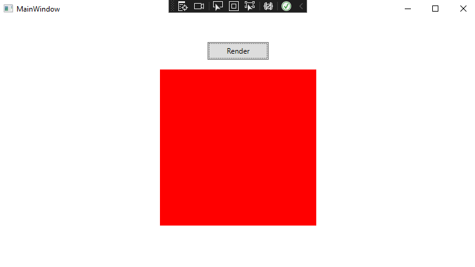

# BoxRayTracer

## Description
This application is a CPU-side 3D rendering engine with accompanying WPF front-end. Allows for static visualization of multiple objects and lights in a given scene, with configurable parameters for objects, lighting, and camera. 

## Purpose
This application is being developed with twofold purpose:
1. As a learning opportunity. This application's development has so far required me to either expand my prior knowledge or learn from scratch in the followign areas:
    * C# development
    * Top-down object-oriented design and solution structure
    * 3D rendering via Distance Estimation (and associated vector math)
    * Lighting principles and implementation
    * ...and more to come!
2. The rendering backend is being built to accomodate a subsequent effort which will implement a GPU-side rendering pipeline.

## Technologies/principles used
* C#
* Distance Estimation based raytracing model
* Blinn-Phong lighting model for ambient, diffuse, and specular components

## Development
This portion of this document will serve as a development journal of sorts, for convenient review by myself and others.

### C# Practice

My first endeavor, before beginning development on the ray tracer, was to tackle a few smaller C# projects to familiarize myself with C# syntax (coming from Java previously), Solution structure, WPF, and other initial aspects of C# development. These projects can be found in my ["Csharp-Practice" repo](https://github.com/crichards17/Csharp-Practice).

### WPF Setup and Bitmap generation

The first objective was to set up the WPF app, as well as much of the initial rendering backend and Bitmap pipeline. The milestone here was the ability to returna an image from the raytracer (in this case, returning a single color value for all pixels) and displaying it on the front end.

### Imaging the first sphere via DE

### Camera and object parameters implemented in the front end

### Lighting model (Blinn-Phong)

### Multiple Objects in the scene

